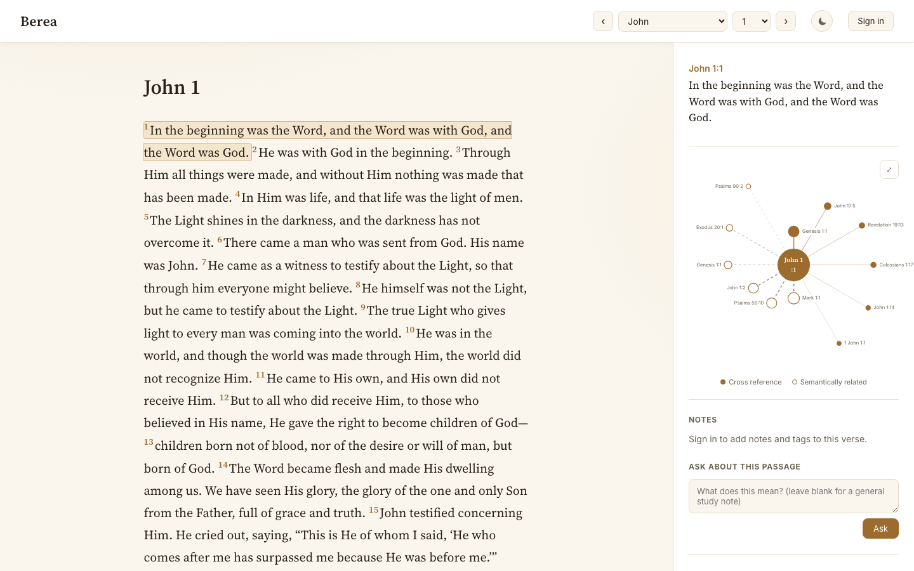
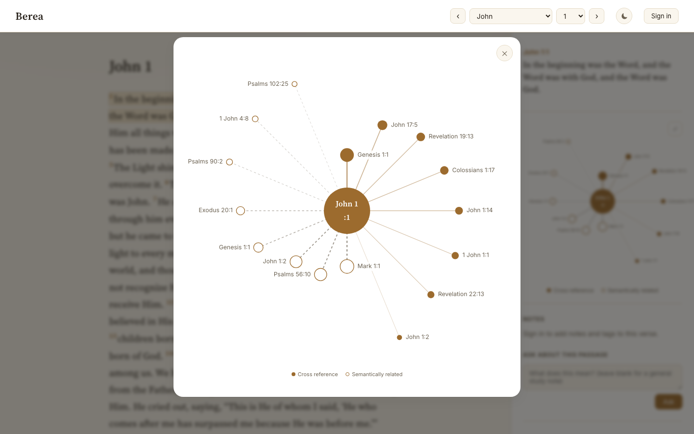
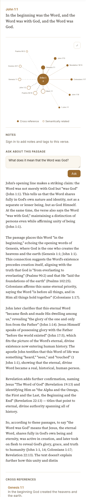
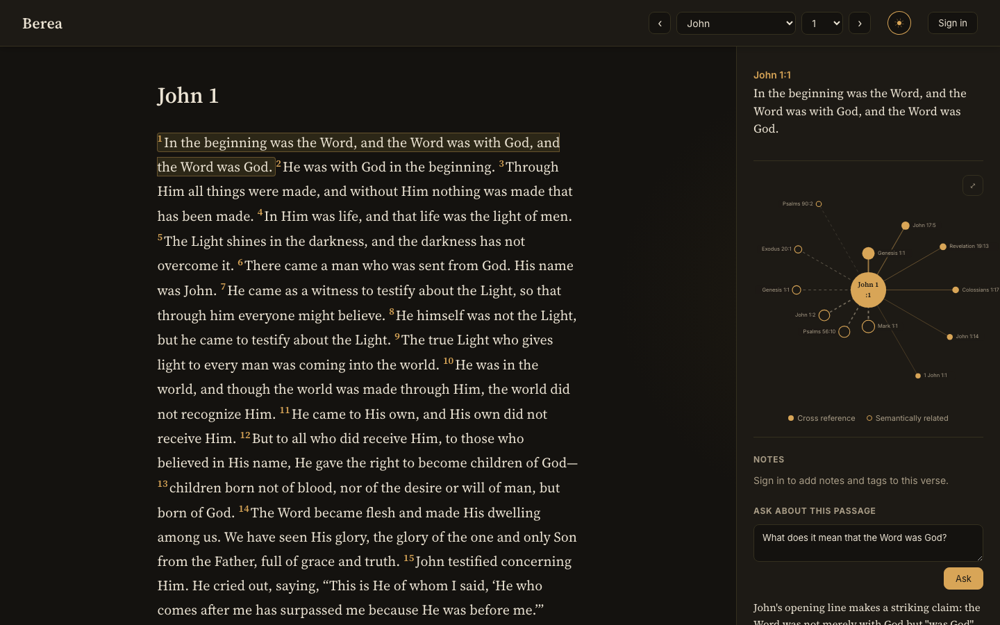
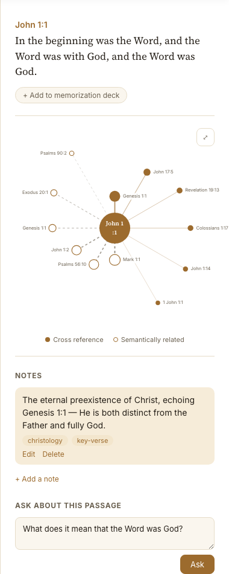
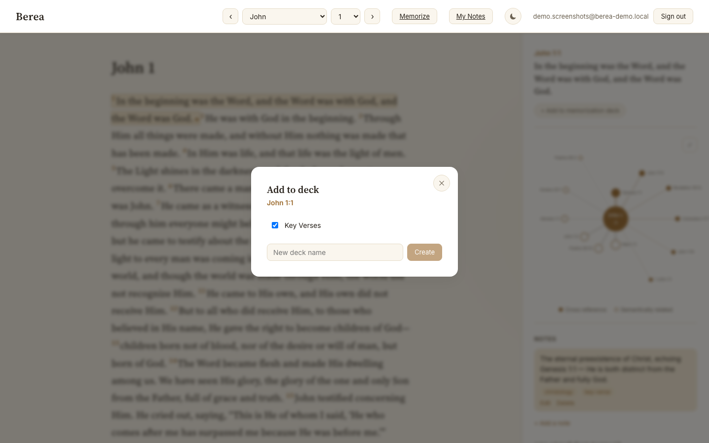
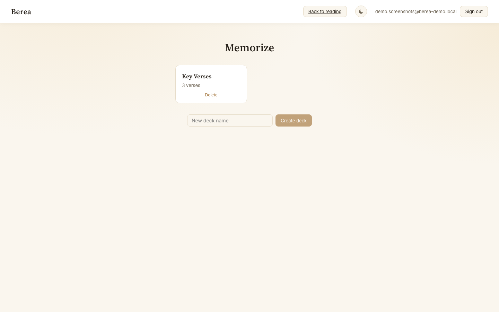
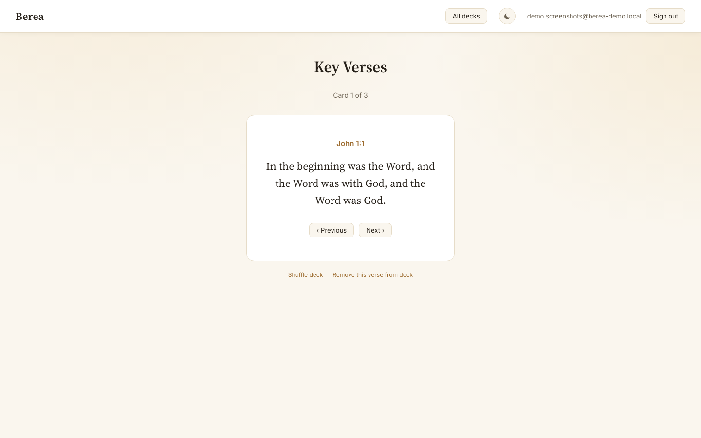

# Berea

**An AI-powered Bible study companion** — read Scripture, explore how verses connect to each other (both the traditional way and semantically, via AI embeddings), ask grounded questions about any passage, take notes, and build your own memorization decks.

> *"Now the Bereans were more noble than those in Thessalonica, in that they received the word with all readiness, and searched the Scriptures daily, whether those things were so."* — Acts 17:11

The name is the point: Berea is built for people who want to dig into the text themselves, not just take a preacher's word for it. Every AI-generated answer in this app is grounded in — and cited against — actual verses, never speculation.



---

## What it does

### 📖 Read, with context always one click away
The full Berean Standard Bible, verse by verse. Click any verse and a panel opens beside it with everything relevant to that passage — no page reloads, no losing your place.

### 🕸️ Two kinds of cross-references, visualized
- **Cross References** — the traditional, scholar-curated connections (in the spirit of the Treasury of Scripture Knowledge), sourced from OpenBible.info.
- **Semantically Related** — verses an AI embedding model finds *meaningfully* similar, even when no human ever formally linked them. Every one of the Bible's ~31,000 verses was embedded with Voyage AI and indexed for fast vector search (pgvector + HNSW).

Both are rendered as an animated, radial graph — the selected verse at the center, related verses orbiting it, sized and colored by relevance. Click **⤢** to expand it full-size.



### 💬 Ask a question, get a grounded answer
Type a question about the passage you're reading (or leave it blank for a general study note) and Claude answers — but *only* using the verse itself plus its cross-references and semantic matches, citing every claim inline. If the provided verses don't support an answer, it says so instead of guessing.



### 🌓 Light or dark, your call
A real toggle, not just `prefers-color-scheme` — because a portfolio demo shouldn't depend on the reviewer's OS settings.



### 📝 Notes and tags, right where you're reading
Sign in, and every verse gets a **Notes** section: write freeform notes, tag them (`christology`, `key-verse`, whatever makes sense to you), and revisit them all later from a filterable **My Notes** page.



### 🗂️ Build your own memorization decks
No forced spaced-repetition schedule, no "come back tomorrow" gate — just decks you name yourself, verses you add from anywhere in the app, and a flashcard view you can shuffle and repeat as many times as you want.



| Your decks | Studying a deck |
|---|---|
|  |  |

---

## How it's built

**Frontend** — React 19 + TypeScript + Vite, `react-router-dom` for routing, `framer-motion` for the graph and page transitions. No CSS framework — a small hand-built design system (CSS custom properties, light/dark themes) in `src/index.css` / `src/App.css`.

**Database** — Supabase (Postgres + `pgvector`). Verses, canonical cross-references (stored as ranges, not exploded per-verse), user notes, decks, and memorization cards all live in Postgres with row-level security so every user only ever sees their own notes/decks.

**Semantic search** — every verse is embedded with **Voyage AI's `voyage-3-lite`** (512 dimensions — chosen deliberately to stay well within Supabase's free-tier storage cap; the original 1024-dim model and its ivfflat/HNSW index alone blew past 500MB). An **HNSW** index over the embedding column powers sub-second nearest-neighbor search, exposed as a single Postgres RPC (`match_verses`).

**RAG-grounded Q&A** — a small serverless function (`api/ask.ts`, written to the **Vercel Node function** convention) retrieves the target verse plus its top cross-references and semantic matches, then asks **Claude (Anthropic API)** to answer using *only* that retrieved context, with inline citations. The Anthropic API key never touches the browser. A matching local dev server (`server/dev-api.ts`) runs the identical handler during `npm run dev` so there's no behavioral drift between local and deployed.

**Auth** — Supabase email/password auth. (Originally built as passwordless magic-link — switched to password auth because magic links send an email on *every* sign-in, which burns through Supabase's free-tier email quota almost immediately during development. Password auth only touches email once, at signup confirmation.)

**Data sources**
- Bible text: [Berean Standard Bible](https://berean.bible) (BSB) — public-domain-equivalent, free for any use.
- Cross-references: [OpenBible.info](https://www.openbible.info/labs/cross-references/) Treasury-of-Scripture-Knowledge-style dataset (CC-BY).

---

## Project structure

```
api/                   Vercel serverless functions (RAG Q&A endpoint)
server/                Local dev server mirroring the Vercel function for `npm run dev`
src/
  components/           All UI: reader, cross-reference panel + radial graph,
                         notes, memorization decks, auth
  lib/                  Supabase client, typed queries, auth/theme context, SM-free
                         deck logic
  data/                 Static book/chapter structure (avoids DB round-trips for nav)
scripts/
  ingest-bible.ts        Loads BSB text + cross-references into Postgres
  generate-embeddings.ts Embeds every verse via Voyage AI
  build-hnsw-index.ts    Builds the HNSW vector index (needs a direct DB connection —
                         building it is too slow for the Supabase SQL Editor's timeout)
  capture-screenshots.mjs Playwright script that generates the screenshots in this README
supabase/migrations/     Numbered SQL migrations — the schema's real history, including
                         the embedding-dimension change and the SM-2 → decks rebuild
```

## Running it locally

You'll need a Supabase project (with the `vector` extension enabled), a Voyage AI API key, and an Anthropic API key.

```bash
npm install
cp .env.local.example .env.local   # fill in your keys — see below
npm run dev          # Vite frontend, http://localhost:5174
```

The frontend expects the local API function to be running too (proxied at `/api`):

```bash
npx tsx watch server/dev-api.ts    # serves api/ask.ts on :8787
```

Environment variables (`.env.local`):

```
VITE_SUPABASE_URL=
VITE_SUPABASE_ANON_KEY=
SUPABASE_SERVICE_ROLE_KEY=     # scripts only — never shipped to the client
DATABASE_URL=                  # direct Postgres connection — for index builds only
ANTHROPIC_API_KEY=             # server-side only (api/, server/)
VOYAGE_API_KEY=                # server-side only (scripts/)
```

First-time data setup (run once against a fresh database):

```bash
npm run ingest:bible                          # loads Bible text + cross-references
npx tsx scripts/generate-embeddings.ts        # embeds all ~31k verses
npx tsx scripts/build-hnsw-index.ts           # builds the vector index
```

---

## Why this exists

This started as a portfolio project, but the goal was never "just build something that runs" — it's meant to hold together as a real, coherent product: a genuine data pipeline (ingestion → embeddings → indexed vector search), a real security boundary around the AI key, row-level security on every piece of user data, and a UI that a real Bible study nerd would actually want to use. If something looked done but wasn't *actually* correct — a spaced-repetition schedule nobody asked for, an index built before there was data to index, an auth flow that quietly exhausted an email quota — it got rebuilt rather than left in place.
